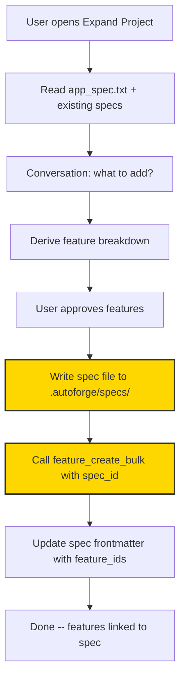
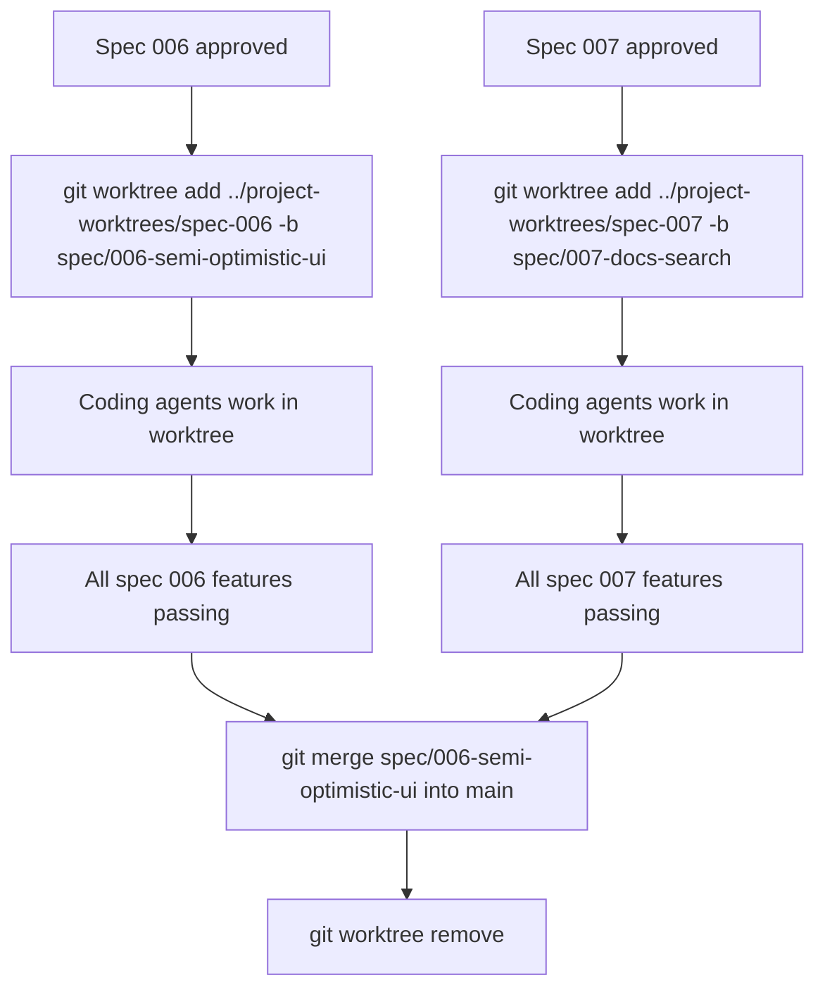

# ADR-005: Spec Evolution -- Linking Features to Their Origin Specs

| Field       | Value                     |
|-------------|---------------------------|
| **Status**  | Proposed                  |
| **Date**    | 2026-02-18                |
| **Author**  | AutoForge Core Team       |

---

## Context

AutoForge projects are born from a single `app_spec.txt` file. The initializer agent reads this spec, decomposes it into features, and stores them in `features.db`. From that point forward, the spec is effectively frozen -- but the project is not.

Projects grow through two mechanisms:

1. **Expand Project** (`/expand-project` slash command or UI modal) -- a conversational flow that adds features via `feature_create_bulk`
2. **Project Assistant** (AI chat panel) -- a read-only assistant that can also create features via `feature_create` and `feature_create_bulk`

Both of these mechanisms create features with **zero provenance**. Once features land in `features.db`, there is no record of *why* they were created, *what conversation* produced them, or *which expansion wave* they belong to.

### Problems Observed in Production

Using the EventBoard project as a concrete example (250 features across 7 expansion rounds):

| Problem | Impact |
|---------|--------|
| **Stale `app_spec.txt`** | The spec says `feature_count: 63` but the project has 250 features. The coding agent reads this stale spec every session (STEP 1 of the coding prompt: `cat app_spec.txt`), so it works with outdated context when implementing feature #243 that was added months after the original spec. |
| **No provenance** | Features have no `spec_id`, `wave_id`, or `batch_id`. Once created, there is no trace of their origin. Was feature #187 part of the CQRS pipeline addition or the accessibility pass? Nobody knows without manually checking git blame on the database. |
| **Duplicate infrastructure features** | The Expand Project tool and Assistant both re-create foundation features because they cannot see what already exists. Observed exact duplicates: features #1/#64 ("NATS connection healthy"), features #4/#67 ("No mock data"). |
| **Truncated spec context** | The Assistant embeds `app_spec.txt` in its system prompt but truncates it at 5000 characters (`assistant_chat_session.py` line 78-79), losing most of the spec for larger projects. |
| **No iteration concept** | AutoForge treats all features as a flat backlog with priorities and dependencies. There is no sprint, wave, or iteration concept -- making it impossible to answer "how far along is the CQRS migration?" |
| **Coding agent lacks feature context** | The coding agent gets the full (stale) app spec but has no context about *why* a specific feature exists. Feature #210 ("Event replay supports idempotency keys") makes much more sense when the agent can read the spec that motivated it. |
| **CLAUDE.md overwrite conflict** | The Project Assistant and Spec Creation sessions both **overwrite** the project's `CLAUDE.md` with their own system prompt on every session start (`assistant_chat_session.py:260-262`, `spec_chat_session.py:125-135`). All three agent types use `setting_sources=["project"]` which reads `CLAUDE.md` (`client.py:457`, `assistant_chat_session.py:283`, `spec_chat_session.py:156`). This means: (1) any custom `CLAUDE.md` written for the coding agent is destroyed when the user opens the assistant panel, (2) the coding agent reads the assistant's system prompt as its project context — completely wrong instructions, and (3) project-specific coding conventions, architecture decisions, and build instructions placed in `CLAUDE.md` are silently lost. The assistant and spec sessions should use a separate file (e.g., `.autoforge/.assistant_claude.md`) instead of clobbering the project's actual `CLAUDE.md`. |

### Current Architecture

```
project/
  .autoforge/
    prompts/
      app_spec.txt              # Written once at project creation, never updated
    features.db                 # Flat list of features, no origin tracking
```

The `Feature` model (`api/database.py`) contains:

```python
class Feature(Base):
    id = Column(Integer, primary_key=True)
    priority = Column(Integer)
    category = Column(String(100))
    name = Column(String(255))
    description = Column(Text)
    steps = Column(JSON)
    passes = Column(Boolean)
    in_progress = Column(Boolean)
    dependencies = Column(JSON)
    needs_human_input = Column(Boolean)
    human_input_request = Column(JSON)
    human_input_response = Column(JSON)
```

There is no column linking a feature to its origin.

---

## Decision

Introduce a **Spec Evolution** system that:

1. Preserves `app_spec.txt` as the stable project foundation
2. Records each project evolution as a numbered **spec file** in `.autoforge/specs/`
3. Links features back to the spec that created them via a `spec_id` column
4. Provides spec-level progress tracking

### Proposed File Layout

```
project/
  .autoforge/
    prompts/
      app_spec.txt                      # Stable foundation (unchanged)
    specs/
      001-initial-features.md           # Auto-generated for original spec features
      002-cqrs-pipeline-tests.md        # First expansion wave
      003-semi-optimistic-ui.md         # Second expansion wave
      004-accessibility-audit.md        # Third expansion wave
    features.db                         # Features now have spec_id column
```

### Spec File Format

Each spec is a markdown file with YAML frontmatter:

```markdown
---
id: 2
title: "CQRS Pipeline Tests"
status: complete          # draft | approved | in_progress | complete
created_at: 2026-01-15T14:30:00Z
depends_on_specs: [1]     # optional: specs that should be complete first
feature_ids: [64, 65, 66, 67, 68, 69, 70, 71, 72, 73, 74, 75, 76, 77, 78, 79, 80, 81, 82, 83, 84, 85, 86, 87, 88, 89, 90, 91, 92, 93, 94]
---

## Motivation

The EventBoard API currently uses a simple request-response pattern. We need to
migrate to CQRS (Command Query Responsibility Segregation) to support event
sourcing, replay, and eventual consistency across microservices.

## Scope

**In scope:**
- Command bus with validation pipeline
- Query handlers with read model projections
- Event store with append-only semantics
- Replay mechanism with idempotency keys

**Out of scope:**
- Saga orchestration (deferred to a future spec)
- Cross-service event propagation (requires NATS, covered by spec 001)

## Technical Approach

- Commands are validated DTOs dispatched through a pipeline
- Events are persisted to an append-only store before projecting to read models
- Queries read from denormalized projections, not the event store
- Replay re-processes events from a given sequence number

## Acceptance Criteria

- [ ] All command handlers validate input before dispatching
- [ ] Events are persisted atomically with the command
- [ ] Read model projections are eventually consistent (< 100ms)
- [ ] Replay produces identical read model state

## Feature Decomposition

Features 64-94 cover the CQRS pipeline. Key features:
- #64: Command bus dispatches to correct handler
- #67: Event store append is idempotent
- #78: Read model projection updates within 100ms
- #89: Full replay produces identical state
```

### Database Changes

Add a nullable `spec_id` column to the `Feature` table:

```python
class Feature(Base):
    # ... existing columns ...
    spec_id = Column(Integer, nullable=True, default=None, index=True)
```

Migration function (following the existing pattern in `api/database.py`):

```python
def _migrate_add_spec_id_column(engine) -> None:
    """Add spec_id column to existing databases that don't have it.

    Uses NULL default for backwards compatibility -- existing features
    without a spec association will have spec_id=NULL, meaning they
    belong to the original app_spec.txt.
    """
    with engine.connect() as conn:
        result = conn.execute(text("PRAGMA table_info(features)"))
        columns = [row[1] for row in result.fetchall()]

        if "spec_id" not in columns:
            conn.execute(text(
                "ALTER TABLE features ADD COLUMN spec_id INTEGER DEFAULT NULL"
            ))
            conn.commit()
```

**No separate `specs` table.** Spec metadata lives in the YAML frontmatter of the markdown files. This keeps specs human-readable, git-trackable, and avoids another migration. The `spec_id` on features is simply the `id` field from the frontmatter.

The `Feature.to_dict()` method gains a `spec_id` field:

```python
def to_dict(self) -> dict:
    return {
        # ... existing fields ...
        "spec_id": self.spec_id,
    }
```

### MCP Tool Changes

#### Modified Tools

**`feature_create_bulk`** -- accept optional `spec_id`:

```python
@mcp.tool()
def feature_create_bulk(
    features: Annotated[list[dict], Field(...)],
    spec_id: Annotated[int | None, Field(
        default=None,
        description="Optional spec ID to link all created features to"
    )] = None
) -> str:
    """Create multiple features, optionally linked to a spec."""
    # ... existing validation ...
    for i, feature_data in enumerate(features):
        db_feature = Feature(
            # ... existing fields ...
            spec_id=spec_id,  # NEW: link to originating spec
        )
```

**`feature_create`** -- accept optional `spec_id`:

```python
@mcp.tool()
def feature_create(
    category: ..., name: ..., description: ..., steps: ...,
    spec_id: Annotated[int | None, Field(
        default=None,
        description="Optional spec ID to link this feature to"
    )] = None
) -> str:
```

#### New Tools

**`spec_list`** -- list all specs with progress:

```python
@mcp.tool()
def spec_list() -> str:
    """List all evolution specs with their status and feature progress.

    Reads spec files from .autoforge/specs/ and computes progress
    by counting passing features for each spec_id.

    Returns:
        JSON with: specs (list of {id, title, status, feature_count,
        passing_count, percentage})
    """
```

**`spec_get`** -- get spec details with linked features:

```python
@mcp.tool()
def spec_get(
    spec_id: Annotated[int, Field(description="The spec ID to retrieve", ge=1)]
) -> str:
    """Get a spec's full details including linked feature progress.

    Returns:
        JSON with: id, title, status, body (markdown content),
        features (list of {id, name, passes}), progress (passing/total)
    """
```

### Flow Changes

#### Expand Project Flow



**Current flow** (`expand_chat_session.py`):
1. Read `app_spec.txt` for context
2. Conversation with user
3. Call `feature_create_bulk` -- features have no origin

**Proposed flow:**
1. Read `app_spec.txt` + all files in `.autoforge/specs/` for context
2. Read existing features via `feature_get_stats` and `feature_get_ready` to prevent duplicates
3. Conversation with user
4. Write spec file to `.autoforge/specs/NNN-slug.md` with status `draft`
5. Present spec for approval, update status to `approved`
6. Call `feature_create_bulk` with `spec_id=NNN`
7. Update spec frontmatter with `feature_ids` list

#### Assistant Changes

The assistant (`assistant_chat_session.py`) needs several changes:

1. **Remove the 5000-char truncation** of `app_spec.txt` (line 78-79) or raise the limit significantly. The full spec should be available as a file the assistant can read on demand rather than embedded in the system prompt.

2. **Add spec awareness** to the system prompt:

```python
def get_system_prompt(project_name: str, project_dir: Path) -> str:
    # ... existing code ...

    # Load spec evolution history
    specs_dir = project_dir / ".autoforge" / "specs"
    spec_summaries = []
    if specs_dir.exists():
        for spec_file in sorted(specs_dir.glob("*.md")):
            # Parse YAML frontmatter for summary
            # ... extract id, title, status ...
            spec_summaries.append(f"- Spec {id}: {title} ({status})")

    # Add to system prompt
    spec_context = "\n".join(spec_summaries) if spec_summaries else "(No evolution specs)"
```

3. **Add anti-duplication instruction** to the system prompt:

```
## Before Creating Features

ALWAYS check existing features before creating new ones:
1. Use feature_get_stats to see current feature count
2. Use feature_get_ready and feature_get_blocked to see existing features
3. Read .autoforge/specs/ to understand what has already been planned
4. Reference existing feature IDs as dependencies -- never re-create infrastructure features
```

4. **Add `spec_list` and `spec_get`** to the assistant's allowed tools:

```python
READONLY_FEATURE_MCP_TOOLS = [
    "mcp__features__feature_get_stats",
    "mcp__features__feature_get_by_id",
    "mcp__features__feature_get_ready",
    "mcp__features__feature_get_blocked",
    "mcp__features__spec_list",      # NEW
    "mcp__features__spec_get",       # NEW
]
```

#### Coding Prompt Changes

The coding prompt template (`.claude/templates/coding_prompt.template.md`) STEP 1 currently reads:

```bash
# 3. Read the project specification to understand what you're building
cat app_spec.txt
```

The proposed change adds spec-aware context loading:

```bash
# 3. Read the project specification
cat app_spec.txt

# 4. After getting your assigned feature, read its spec for focused context
#    (The orchestrator passes SPEC_FILE as an environment variable)
if [ -n "$SPEC_FILE" ]; then
  cat "$SPEC_FILE"
fi
```

The orchestrator (`autonomous_agent_demo.py`) would look up the feature's `spec_id`, resolve it to a file path, and pass it as an environment variable. This gives the coding agent **focused context** about why the feature exists without loading every spec.

---

## Open Design Decision: Spec Authoring UX and Storage

This is the most consequential design choice in the proposal. There are three viable approaches, each with significant tradeoffs. The choice affects the entire user experience and system complexity.

### Option A: Files in `.autoforge/specs/` (As Proposed Above)

Specs are markdown files with YAML frontmatter. The `spec_id` in `features.db` maps to the file's numeric prefix.

**Strengths:**
- Git-trackable, diffable, reviewable in PRs
- Editable in any editor (VSCode, vim, etc.)
- Human-readable without tooling
- Works from the command line (terminal workflow in VSCode)

**Weaknesses:**
- **Fragile relationship** — file can be renamed, moved, or deleted while `features.db` still references `spec_id=6`. The anchor between DB and filesystem is a naming convention, not a foreign key.
- No built-in UI for review/iteration — the user must switch between the Autoforge UI and their editor
- YAML frontmatter parsing adds complexity and failure modes
- The coding agent reads a file path that may not exist if the spec was moved

### Option B: Specs in SQLite (Single Source of Truth)

Specs are rows in a `specs` table in `features.db`. Features reference them via a real `FOREIGN KEY(spec_id) REFERENCES specs(id)`.

```sql
CREATE TABLE specs (
    id INTEGER PRIMARY KEY AUTOINCREMENT,
    title TEXT NOT NULL,
    status TEXT NOT NULL DEFAULT 'draft',  -- draft, approved, in_progress, complete
    motivation TEXT,                        -- Why this evolution?
    scope TEXT,                             -- What's in/out
    technical_approach TEXT,                -- How to implement
    acceptance_criteria TEXT,               -- How to verify
    feature_decomposition TEXT,            -- The approved feature breakdown
    created_at TIMESTAMP DEFAULT CURRENT_TIMESTAMP,
    approved_at TIMESTAMP,
    completed_at TIMESTAMP
);
```

**Strengths:**
- **Robust anchor** — `FOREIGN KEY` guarantees the relationship. No file can be renamed or deleted without breaking a constraint.
- Single source of truth — no sync between files and DB
- The UI renders specs directly from the database (same pattern as features on the kanban board)
- The existing feature MCP tools pattern extends naturally (`spec_create`, `spec_update`, `spec_list`, `spec_get`)
- Works identically in CLI and UI workflows

**Weaknesses:**
- Not git-trackable (unless exported)
- Not human-readable without tooling
- Editing requires the UI or MCP tools — no quick `vim .autoforge/specs/006.md`

**Mitigation:** Auto-export specs as markdown to `.autoforge/specs/` on every status change. These exports are read-only artifacts for git tracking and agent context — the DB is the source of truth. If the file is deleted or modified, nothing breaks.

### Option C: Hybrid — DB is Truth, Files are Projections (Recommended)

This combines the robustness of Option B with the readability of Option A:

1. **Specs table in SQLite** — the authoritative source. `spec_id` is a real foreign key.
2. **Markdown files auto-exported** to `.autoforge/specs/` on every spec status change — for git tracking, agent context, and human readability.
3. **Files are read-only projections** — editing happens through the UI or MCP tools, never by modifying the files directly. (If someone does edit a file, it's ignored until the next DB export overwrites it.)

This follows the same pattern as the EventBoard project's own architecture: **events in JetStream (source of truth) → projections in KV (read model)**. Here it's: **specs in SQLite (source of truth) → markdown in filesystem (read projection)**.

### Spec Authoring in the UI

The Autoforge WebUI currently has two underutilized views:

1. **The Initial/Create Project view** — mostly empty after project creation
2. **The Expand Project modal** — a chat window that disappears after feature creation

The proposal is to replace/augment these with a **Spec Workspace**:

```
+------------------------------------------------------------------+
|  EventBoard                                    [Kanban] [Specs]  |
+------------------------------------------------------------------+
|                                                                   |
|  +---------------------------+  +------------------------------+ |
|  | Spec List                 |  | Spec 006: Semi-Optimistic UI | |
|  |                           |  |                              | |
|  | 001 CQRS Pipeline    [✓] |  | Status: [In Progress ▼]     | |
|  | 002 Testing Infra    [✓] |  |                              | |
|  | 003 CLI + Shared Mod  [✓] |  | ## Motivation               | |
|  | 004 Deployment        [✓] |  | Users experience lag when   | |
|  | 005 Documentation     [✓] |  | dragging cards because SSE  | |
|  | 006 Semi-Optimistic   [►] |  | round-trips take 50-200ms.  | |
|  | 007 Docs Search       [·] |  |                              | |
|  |                           |  | ## Scope                    | |
|  | [+ New Spec]              |  | - Zustand persist store     | |
|  +---------------------------+  | - useOptimisticOverlay hook | |
|                                 | - Per-operation overlays     | |
|                                 |                              | |
|                                 | ## Features (3/10 passing)  | |
|                                 | ✓ #241 Settings store       | |
|                                 | ✓ #242 useOptimistic hook   | |
|                                 | ✓ #248 Navbar toggle        | |
|                                 | ○ #243 Cross-column move    | |
|                                 | ○ #244 Within-column reorder| |
|                                 | ○ #245 Card rename          | |
|                                 | ...                          | |
|                                 +------------------------------+ |
|                                                                   |
|  +-------------------------------------------------------------+ |
|  | AI Chat (Spec Context)                                       | |
|  |                                                               | |
|  | You: Add optimistic UI for drag operations                    | |
|  | AI: I'll create a spec for semi-optimistic UI. Here's my      | |
|  |     proposed decomposition: ...                                | |
|  |                                                               | |
|  | [Type a message...]                              [Send]       | |
|  +-------------------------------------------------------------+ |
+------------------------------------------------------------------+
```

**Key UX behaviors:**

1. **"+ New Spec" button** opens the AI chat in spec-creation mode. The conversation is focused: motivation → scope → feature decomposition → approve.

2. **Clicking an existing spec** renders it in the detail pane with live feature progress. The spec content is editable (rich markdown editor or structured form fields).

3. **The AI chat is contextual** — when a spec is selected, the chat is scoped to that spec. "Add two more features for error handling" adds features with `spec_id=6`.

4. **Spec status transitions** are explicit buttons: Draft → Approved → In Progress (agent started) → Complete (all features passing).

5. **The Kanban board gains a filter** — "Show features from Spec 006" filters the board to only that spec's features. Or a group-by-spec view.

### CLI Workflow

For users who prefer terminal/VSCode:

```bash
# List specs
autoforge specs list --project eventboard

# Show spec details with feature progress
autoforge specs show 006 --project eventboard

# Create a new spec interactively (opens AI chat in terminal)
autoforge specs create --project eventboard

# Export all specs as markdown (for git/review)
autoforge specs export --project eventboard
```

The exported markdown files serve as the read-only projection — they can be committed, reviewed in PRs, and read by the coding agent. But edits happen through the CLI or UI, which write to the database.

### Recommendation

**Option C (DB + auto-exported files)** is recommended because:

1. The `spec_id` ↔ `features` relationship is a real foreign key, not a filename convention
2. The UI can render specs directly (same as features on the kanban board)
3. Markdown exports give git trackability and agent readability
4. The existing Expand Project modal and Assistant chat can evolve into the spec workspace without a ground-up rewrite
5. It matches AutoForge's own architectural pattern: SQLite is the source of truth, files are projections

---

## Consequences

### Positive

- **Features have provenance.** Every feature traces back to a decision document. "Why does feature #187 exist?" is answered by reading spec 004.
- **Coding agent gets relevant context.** Instead of a stale monolithic spec, the agent reads the specific evolution spec for its assigned feature. Feature #210 ("Event replay supports idempotency keys") is implemented with full knowledge of the CQRS migration rationale.
- **No more duplicate infrastructure features.** The Expand Project tool reads existing specs and features before creating new ones. The instruction "never re-create infrastructure features" is backed by visible data.
- **Spec-level progress tracking.** "Spec 003: 7/15 features passing" gives sprint-like visibility without a formal sprint system. The UI kanban board can group features by spec.
- **Evolution history is human-readable.** Auto-exported markdown files in `.autoforge/specs/` are git-trackable, diffable, and readable without tooling. The DB is the source of truth; files are projections.
- **Backward compatible.** Nullable `spec_id` means existing projects work unchanged. Features with `spec_id=NULL` belong to the original `app_spec.txt`.

### Negative

- **Additional complexity in the feature creation flow.** The Expand Project tool now writes a file before creating features, adding one step to the flow.
- **Migration needed for existing projects.** The `spec_id` column must be added via `ALTER TABLE`. This follows the established migration pattern in `api/database.py` and is low-risk.
- **Spec files add to the project's file count.** A project with 10 expansion waves gains 10 markdown files. This is a modest increase.
- **Two places to look for project context.** `app_spec.txt` is the foundation; specs (in DB, exported to `.autoforge/specs/`) contain the evolution history. This split is intentional (stable vs. changing) but requires documentation.
- **New UI surface needed.** The Spec Workspace view is a significant UI addition (spec list, detail pane, contextual chat). This can be implemented incrementally by evolving the existing Expand Project modal.

### Risks

| Risk | Mitigation |
|------|------------|
| Spec files become stale if features are manually created without a spec | Features created via the UI "+" button get `spec_id=NULL`. The UI can show "unlinked features" as a separate group. |
| YAML frontmatter parsing errors | Use a well-tested YAML parser (PyYAML, already in the dependency tree). Validate frontmatter on write, not just read. |
| Spec numbering conflicts in parallel expand sessions | Use a lock file or atomic directory listing + increment pattern. Alternatively, use timestamps in filenames. |
| Spec files diverge from actual features (features deleted, re-ordered) | The `feature_ids` in frontmatter is informational. The source of truth is always `features.db` with the `spec_id` column. |

---

## Migration Strategy

### For Existing Projects

1. **Database migration** -- `_migrate_add_spec_id_column` adds the nullable column. All existing features get `spec_id=NULL`. This happens automatically on next database open, following the established pattern.

2. **No spec files required** -- Projects without a `specs/` directory continue to work. The absence of specs means all features belong to the original `app_spec.txt`.

3. **Optional retroactive spec creation** -- A one-time utility can create specs from feature ID ranges:

```bash
# Retroactively create spec for features 64-94 (the CQRS wave)
autoforge retrospec --project my-app --features 64-94 --title "CQRS Pipeline Tests"
```

This would:
- Create `.autoforge/specs/002-cqrs-pipeline-tests.md` with a template
- Update `features.db` to set `spec_id=2` for features 64-94
- Populate the `feature_ids` list in the frontmatter

### For New Projects

New projects get spec awareness from day one:
- The initializer agent's features get `spec_id=NULL` (they belong to `app_spec.txt`)
- The first Expand Project session creates `001-*.md`
- Subsequent expansions increment the spec number

---

## Alternatives Considered

### 1. Append Waves to `app_spec.txt`

Rejected. This turns `app_spec.txt` into an ever-growing document that mixes stable architecture decisions with transient evolution history. The coding agent would read an increasingly large spec every session, with most of it irrelevant to the current feature.

### 2. Store Specs Entirely in the Database

Possible, but loses the human-readable, git-trackable aspect of markdown files. Spec documents are meant to be read by humans and reviewed in pull requests. A database blob is the wrong medium for this content.

### 3. No Spec Files, Just `batch_id` on Features

This tracks *which features were created together* but loses the *rationale and context* that makes specs useful for the coding agent. A batch ID without a document is provenance without meaning.

### 4. Use Git Tags/Branches for Waves

Rejected as a standalone solution. Git tags and branches alone don't provide the rationale/context that spec files offer. However, **git worktrees** are proposed as a complementary mechanism — see the "Git Worktrees for Parallel Spec Iterations" section below.

### 5. Embed Spec Content in Each Feature's Description

Rejected. This duplicates content across dozens of features and inflates the database. It also makes it impossible to update the spec rationale without touching every feature.

---

## Git Worktrees for Parallel Spec Iterations

### The Problem with Parallel Agents Today

The current parallel mode (`--concurrency N`) runs multiple coding agents in the same working directory. All agents commit to the same branch, leading to potential git conflicts when concurrent agents run `git add . && git commit`. The orchestrator does not coordinate git operations between agents.

### Proposal: One Worktree per Spec Iteration

When a spec is approved and its features are created, AutoForge could check out a **git worktree** for that spec's implementation:

```
project/                              # Main worktree (trunk)
  .autoforge/
    specs/
      006-semi-optimistic-ui.md
    features.db                       # Shared (SQLite handles concurrency)

project-worktrees/                    # Sibling directory (configurable)
  spec-006-semi-optimistic-ui/        # Worktree for spec 006
    .git -> ../../project/.git        # Shared git object store
    ...                               # Isolated working directory
  spec-007-docs-search/               # Another spec in parallel
    ...
```

### How It Would Work



**Key behaviors:**

1. **`features.db` stays in the main project directory** — it's shared across worktrees. SQLite's WAL mode handles concurrent access safely (already proven by parallel mode).

2. **Each worktree gets its own branch** — `spec/006-semi-optimistic-ui`. Agents in the worktree commit to this branch without affecting trunk or other specs.

3. **No git conflicts between specs** — spec 006 modifies frontend components while spec 007 adds backend search endpoints. They work on separate branches in separate directories.

4. **Merge happens when a spec is complete** — all features in the spec are passing, the branch is merged to main (or a PR is created for review).

5. **The orchestrator routes agents to worktrees** — based on the feature's `spec_id`, the orchestrator sets `cwd` to the appropriate worktree directory when spawning the agent subprocess.

### What This Enables

| Capability | Current (Single Directory) | With Worktrees |
|-----------|---------------------------|----------------|
| Parallel specs | Not possible — all agents share one branch | Each spec gets its own branch + directory |
| Git conflicts | Likely with concurrent commits | Impossible between specs |
| Rollback a spec | Manually revert individual features | `git branch -D spec/006` |
| Code review per spec | No natural boundary | PR per spec branch |
| Bisect regressions | Feature-level granularity | Spec-level granularity (which wave broke it?) |
| CI per spec | Not possible | Run CI on spec branches before merge |

### Constraints and Considerations

- **Git worktrees share the object store** — disk usage is minimal (only the working directory is duplicated, not `.git`).
- **`features.db` must remain shared** — the orchestrator needs a single view of all feature states across all specs. The database path should be absolute, not relative to the worktree.
- **MCP server `PROJECT_DIR`** — needs to distinguish between the worktree path (for file operations) and the main project path (for `features.db`). May need a `FEATURES_DB_DIR` override.
- **`app_spec.txt` and `.autoforge/specs/`** — should be read from the main project, not the worktree, to ensure all agents see the same specs.
- **Merge conflicts within a spec** — still possible if multiple parallel agents within the same spec modify the same file. This is the existing parallel mode problem, scoped to a single spec.
- **Worktree lifecycle** — who creates and removes worktrees? The Expand Project flow could create the worktree on spec approval. The orchestrator could remove it after merge.

### Interaction with Spec Evolution

Git worktrees are a natural extension of the spec concept:

1. **Spec created** → features added to `features.db` with `spec_id`
2. **Spec approved** → worktree created, branch checked out
3. **Agents work** → orchestrator routes agents to worktree based on feature's `spec_id`
4. **Spec complete** → all features passing → merge to main → worktree removed
5. **Parallel specs** → multiple worktrees active simultaneously, each with their own agents

This turns AutoForge from a single-threaded feature pipeline into a **multi-track spec execution engine** — closer to how real teams work with parallel sprints on feature branches.

### Implementation Phase

This would be **Phase 6** (after the core spec evolution system is working):

**Files modified:**
- `parallel_orchestrator.py` — worktree creation/removal, agent routing by spec
- `autonomous_agent_demo.py` — accept `--worktree-dir` for agent subprocess CWD
- `client.py` — separate `PROJECT_DIR` (worktree) from `FEATURES_DB_DIR` (main)
- `mcp_server/feature_mcp.py` — support `FEATURES_DB_DIR` override for database path

**New files:**
- `worktree_manager.py` — git worktree lifecycle (create, list, remove, merge)

---

## Implementation Phases

### Phase 1: Database + MCP (Foundation)

**Scope:** Add `specs` table, add `spec_id` foreign key to `Feature`, update MCP tools.

**Files modified:**
- `api/database.py` -- add `Spec` model (`id`, `title`, `status`, `motivation`, `scope`, `technical_approach`, `acceptance_criteria`, `feature_decomposition`, timestamps), add `spec_id` column to `Feature` with foreign key, migration functions
- `mcp_server/feature_mcp.py` -- add `spec_id` parameter to `feature_create_bulk` and `feature_create`, add `spec_create`, `spec_update`, `spec_list`, `spec_get` tools

**Validation:** Existing tests pass. New features can optionally include `spec_id`.

### Phase 2: Spec File Export (Read Projections)

**Scope:** Auto-export specs as markdown to `.autoforge/specs/` on every status change. These files are read-only projections for git tracking and agent context.

**Files modified:**
- `autoforge_paths.py` -- add `get_specs_dir()` path resolver
- `mcp_server/feature_mcp.py` -- trigger export on `spec_create` and `spec_update`

**New files:**
- `api/spec_manager.py` -- markdown export logic, spec numbering, `.autoforge/specs/` lifecycle

### Phase 3: Expand Project Integration

**Scope:** The Expand Project flow writes a spec file before creating features.

**Files modified:**
- `.claude/commands/expand-project.md` -- add spec-writing step before feature creation
- `server/services/expand_chat_session.py` -- add spec file tools to allowed tools list

### Phase 4: Assistant Integration

**Scope:** The Assistant reads specs, prevents duplicates, uses `spec_list`/`spec_get`.

**Files modified:**
- `server/services/assistant_chat_session.py` -- add spec tools, remove truncation, add anti-duplication instructions
- `server/services/chat_constants.py` -- spec-related constants if needed

### Phase 5: Coding Prompt Integration

**Scope:** The coding agent reads the relevant spec for its assigned feature.

**Files modified:**
- `.claude/templates/coding_prompt.template.md` -- add spec-reading step
- `autonomous_agent_demo.py` -- look up feature's `spec_id`, pass `SPEC_FILE` env var
- `client.py` -- forward `SPEC_FILE` to the agent environment

### Phase 6: Spec Workspace UI

**Scope:** New UI view for authoring, reviewing, and tracking specs. Replaces the underutilized Expand Project modal.

**Files modified:**
- `ui/src/App.tsx` -- add Specs tab/route alongside Kanban
- `server/routers/features.py` -- add spec REST endpoints (CRUD, status transitions)
- `server/services/expand_chat_session.py` -- refactor to spec-scoped chat (chat creates/modifies a specific spec)

**New files:**
- `ui/src/components/SpecWorkspace.tsx` -- spec list + detail pane layout
- `ui/src/components/SpecDetail.tsx` -- spec content rendering with live feature progress
- `ui/src/components/SpecChat.tsx` -- AI chat scoped to a selected spec
- `ui/src/hooks/useSpecs.ts` -- React Query hooks for spec API
- `server/routers/specs.py` -- dedicated spec router

**Validation:** User can create a spec via conversation, review it in the detail pane, approve it, and see linked features on the kanban board.

### Phase 7: CLI Spec Commands

**Scope:** Terminal-based spec management for VSCode/command-line workflows.

**Files modified:**
- `start.py` -- add spec management to CLI menu
- `autonomous_agent_demo.py` -- accept `--spec-id` to scope agent work to a spec

**New files:**
- `spec_cli.py` -- `autoforge specs list|show|create|export` commands

**Validation:** Full spec lifecycle from terminal without needing the web UI.

### Phase 8: Git Worktrees for Parallel Specs

**Scope:** Each approved spec gets its own git worktree and branch. Agents are routed to worktrees based on feature `spec_id`. Merge to main when all spec features pass.

**Files modified:**
- `parallel_orchestrator.py` -- worktree creation/removal, agent routing by `spec_id`
- `autonomous_agent_demo.py` -- accept `--worktree-dir` for agent subprocess CWD
- `client.py` -- separate `PROJECT_DIR` (worktree) from `FEATURES_DB_DIR` (main project)
- `mcp_server/feature_mcp.py` -- support `FEATURES_DB_DIR` override for database path

**New files:**
- `worktree_manager.py` -- git worktree lifecycle (create, list, remove, merge)

**Validation:** Two specs can run in parallel without git conflicts. Merge to main succeeds after spec completion.

---

## References

| File | Relevance |
|------|-----------|
| [`api/database.py`](../../api/database.py) | Feature model, migration pattern, `create_database()` |
| [`mcp_server/feature_mcp.py`](../../mcp_server/feature_mcp.py) | MCP tools: `feature_create_bulk`, `feature_create` |
| [`server/services/expand_chat_session.py`](../../server/services/expand_chat_session.py) | Expand Project session, `EXPAND_FEATURE_TOOLS` |
| [`server/services/assistant_chat_session.py`](../../server/services/assistant_chat_session.py) | Assistant session, 5000-char truncation (line 78), `ASSISTANT_FEATURE_TOOLS` |
| [`.claude/commands/expand-project.md`](../../.claude/commands/expand-project.md) | Expand Project skill/slash command |
| [`.claude/templates/coding_prompt.template.md`](../../.claude/templates/coding_prompt.template.md) | Coding agent prompt, STEP 1 spec reading |
| [`autoforge_paths.py`](../../autoforge_paths.py) | Path resolution with tri-path strategy |
| [`prompts.py`](../../prompts.py) | Prompt loading with fallback chain |
| [`autonomous_agent_demo.py`](../../autonomous_agent_demo.py) | Agent entry point, environment setup |
| [`client.py`](../../client.py) | `ClaudeSDKClient` configuration |
